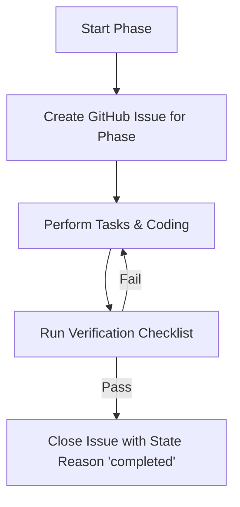

# GitHub Issue Hygiene & Management Guide

This guide establishes the mandatory workflow for managing issues, tracking progress, and maintaining repository hygiene during the development of **Signal Ledger**.

---

## 1. Issue Management Principles

All tasks described in the implementation plan must be tracked using GitHub Issues. This ensures visibility, clarity of intent, and a clean historical trail.

1. **One Issue per Phase (or major sub-task):** Each phase of [IMPLEMENTATION_PLAN_ONE.md](file:///Users/aarongreen/Desktop/app-search-engine/planning/IMPLEMENTATION_PLAN_ONE.md) must have a corresponding tracking issue.
2. **Commit References:** When making changes, code edits should ideally refer to the issue number in the description.
3. **No Closed Without Verification:** No issue may be closed until its verification plan has been run and confirmed.

---

## 2. Issue Templates & Naming Standards

### Issue Title Format
```text
[Phase X] — <Short, descriptive task name>
```
*Example:* `[Phase 1] — Build programmatic mock article generator`

### Issue Body Template
When creating an issue, the body must follow this structure:
```markdown
## Description
Brief summary of what this issue covers and why it is needed.

## Tasks
- [ ] Checklist item 1
- [ ] Checklist item 2

## Verification Criteria
How to confirm the code behaves correctly once completed.
```

---

## 3. GitHub MCP Tooling Blueprint

The agent must use the following tools from `github-mcp-server` to manage issues:

### A. Creating an Issue
Call `issue_write` with:
- `owner`: `"aaronjorgreen"`
- `repo`: `"app-search-engine"`
- `method`: `"create"`
- `title`: `"[Phase X] — <Title>"`
- `body`: `"<Body content matching the template>"`
- `labels`: `["enhancement", "phase-X"]`

### B. Tracking Progress
Use `add_issue_comment` to add updates (e.g. if blocking issues occur, or when entering intermediate verification phases).

### C. Closing an Issue
Once all verification checks are complete and succeed, call `issue_write` with:
- `owner`: `"aaronjorgreen"`
- `repo`: `"app-search-engine"`
- `method`: `"update"`
- `issue_number`: `<number>`
- `state`: `"closed"`
- `state_reason`: `"completed"`

---

## 4. Execution Workflow

During development, the agent must execute the following loop:



1. **At the start of a phase:** Create the tracking issue immediately before editing files.
2. **During the phase:** Update the implementation checklist files (`IMPLEMENTATION_PLAN_ONE.md` and `task.md`) and keep them aligned.
3. **At the end of a phase:** Run the manual/automated verification steps, comment on the issue with verification results, and close the issue.
