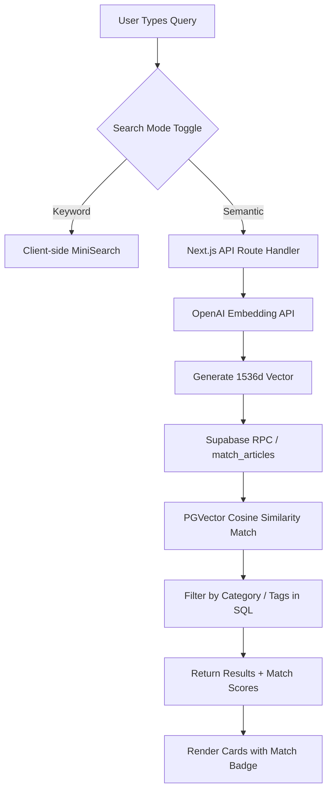

# Implementation Plan — Signal Ledger MVP 2.0 (Semantic Search)

This document outlines the finalized execution steps and checklist for building and implementing AI-powered semantic search, vector embeddings, and similarity ranking using Supabase and OpenAI.

---

## Technical Architecture Overview

We are upgrading the search capabilities of **Signal Ledger** by adding a database-backed **Semantic Search Mode**. This will coexist with the current client-side keyword search (MiniSearch) via a premium UI toggle.



---

## Detailed Implementation Steps

### Phase 1: Environment & Dependencies
**Goal:** Setup Supabase and OpenAI client dependencies and environment keys.
- Install packages:
  - `@supabase/supabase-js` (to interact with our Supabase DB)
  - `openai` (to generate text embeddings server-side)
- Define standard environment variables in `.env.local`:
  - `NEXT_PUBLIC_SUPABASE_URL`
  - `NEXT_PUBLIC_SUPABASE_ANON_KEY`
  - `SUPABASE_SERVICE_ROLE_KEY` (used securely in server/seed environments)
  - `OPENAI_API_KEY` (used securely in server environments)

### Phase 2: Database Migration & Schema Setup
**Goal:** Prepare the Supabase database instance to store articles and vector embeddings.
- Create [planning/supabase_schema.sql](file:///Users/aarongreen/Desktop/app-search-engine/planning/supabase_schema.sql):
  1. Enable the `vector` extension.
  2. Create the `articles` table with:
     - `id` (text, primary key)
     - `title`, `slug`, `description`, `category`, `author`, `date`, `read_time`, `content` (text)
     - `tags` (text array)
     - `embedding` (`vector(1536)` for `text-embedding-3-small`)
  3. Create indexing for vector similarity search (HNSW index on cosine distance: `(embedding vector_cosine_ops)`).
  4. Write the postgres function `match_articles` to perform cosine similarity calculations and filter by category/tags on-db.

### Phase 3: Seeding Database with OpenAI Embeddings
**Goal:** Compute embeddings for the 100 mock articles and upload them to Supabase.
- Create a script [scripts/seed-supabase.ts](file:///Users/aarongreen/Desktop/app-search-engine/scripts/seed-supabase.ts):
  - Load the articles from `public/mock-articles.json`.
  - Batch generate vectors using OpenAI `text-embedding-3-small` by combining `title`, `description`, and `content`.
  - Upsert the populated articles and vectors into the Supabase database.
  - Create a runner script in `package.json`: `"db:seed": "tsx scripts/seed-supabase.ts"`.

### Phase 4: Next.js Search Route Handler
**Goal:** Build a secure API endpoint to fetch semantic search results.
- Create `app/api/search/route.ts`:
  - Accept request body parameters: `query`, `category`, `tags`.
  - If `query` is empty, query all articles from Supabase.
  - If `query` exists, generate a query vector embedding using OpenAI.
  - Call the Supabase RPC function `match_articles` with `query_embedding`, filtering options, and similarity threshold.
  - Set a threshold of `0.2` to `0.3` to filter out completely irrelevant matches.
  - Return matching records with their computed similarity scores.

### Phase 5: Search Hook Integration (Toggle & State)
**Goal:** Upgrade `useArticleSearch.ts` to manage search modes, loading states, and remote calls.
- Extend state properties:
  - `searchMode`: `'keyword' | 'semantic'` (default: `'keyword'`)
  - `setSearchMode`
  - `isLoading`: boolean (true during API calls)
- Modify the result fetch loop:
  - If in keyword mode, use client-side MiniSearch.
  - If in semantic mode:
    - Debounce and trigger an async fetch to `/api/search`.
    - Fetch whenever `query`, `category`, or `selectedTags` changes.
    - Set loading state appropriately.

### Phase 6: UI Refinement & Aesthetics
**Goal:** Elevate search UX with animations, loading states, and relevance visual indicators.
- **Search Toggle**: Add a sleek, glassmorphic switch inside `components/SearchHero.tsx` or `components/FilterSection.tsx` to toggle between "Keyword (Exact Match)" and "Semantic (AI-powered)". Use sliding pill background transitions.
- **Loading Skeleton**: Create a premium results skeleton component (pulsing card gradients) to display while remote embeddings are being resolved.
- **Similarity Badges**: Update `ResultCard.tsx` to render a clean, color-coded relevance badge (e.g., `92% Match` in green/teal) when search results include a similarity score.
- **Hybrid Highlighting**:
  - Keep using `highlightText` inside card titles and snippets to highlight exact term matches when they do occur.
  - Provide a subtle secondary text label or tooltip indicating that the article matches conceptually.

---

## Verification Plan

### Database & Embeddings Verification
1. Run the database setup script in Supabase SQL editor.
2. Execute `npm run db:seed` and verify database records in Supabase panel.

### Endpoint Verification
1. Run local endpoint validation:
   ```bash
   curl -X POST http://localhost:3000/api/search \
     -H "Content-Type: application/json" \
     -d '{"query": "modern development platforms", "category": "Software Trends"}'
   ```
2. Verify cosine similarity ordering and scores returned.

### User Interface Verification
1. Open the search engine at `http://localhost:3000`.
2. Toggle to "Semantic Search" and enter conceptual queries:
   - Example query: "securing venture funding" -> should return founder stories / startup moves about investments, even if "securing venture funding" is not explicitly written.
   - Verify category chips and tags filter the semantic list correctly.
3. Validate loading skeletons and smooth toggle state transitions.
4. Verify responsiveness and keyboard accessibility of all newly added UI elements.
